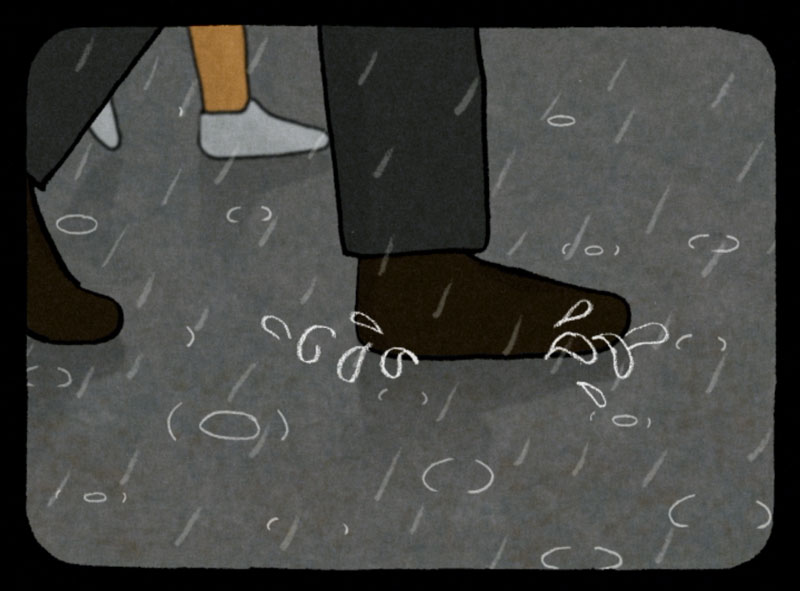
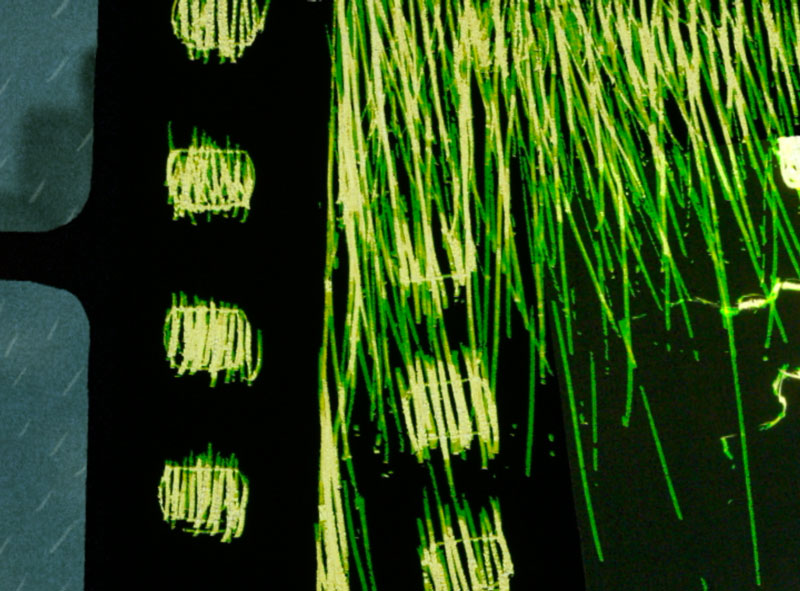
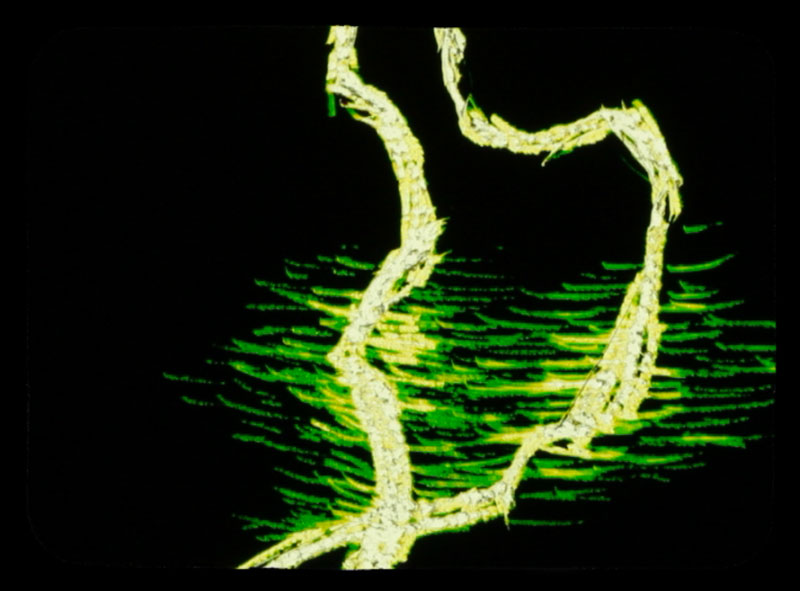
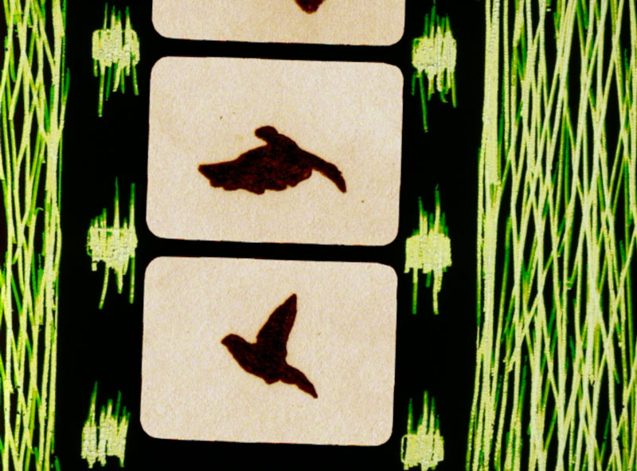
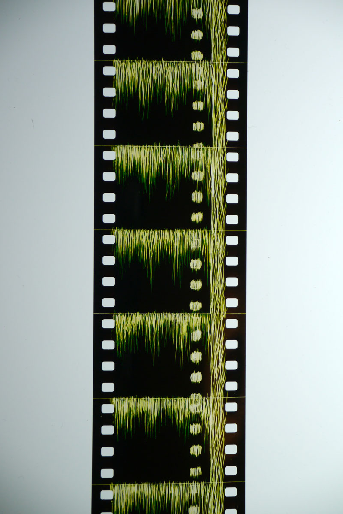

<iframe title="vimeo-player" src="https://player.vimeo.com/video/869635" width="640" height="482" frameborder="0" allowfullscreen></iframe>

The projector advances the film strip at 24 frames per second, converting still images into the illusion of motion.

### Selected Screenings
- Melbourne International Animation Festival, Australia, 2007
- CalArts Experimental Animation Showcase, 2006

