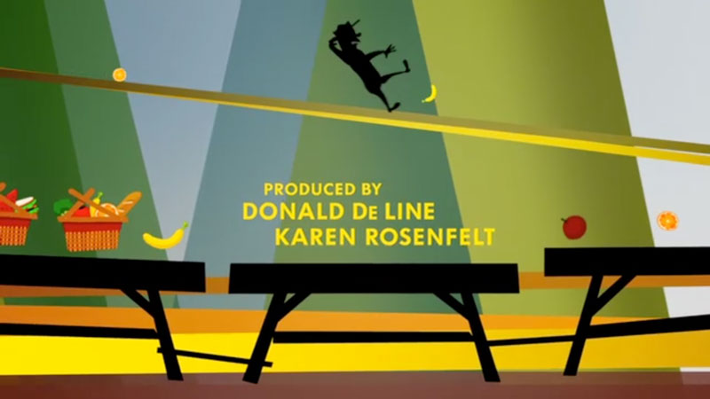
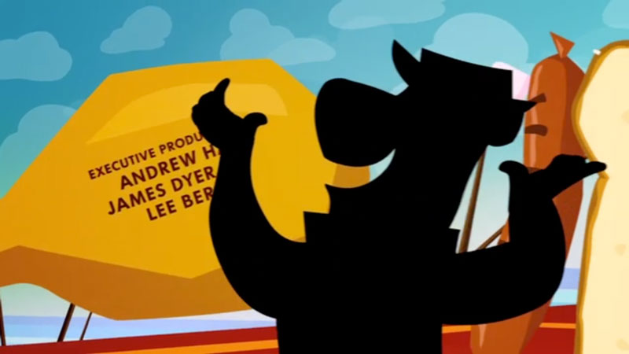

<iframe title="vimeo-player" src="https://player.vimeo.com/video/21071233" width="640" height="360" frameborder="0" allowfullscreen></iframe>

Main-on-end film title sequence animation produced at yU+co.

### Credits
- Client: Warner Bros.
- Design/Animation: yU+Co., Hollywood, CA
- Creative Director: Garson Yu
- Art Director: Synderela Peng
- VFX Director/Supervisor: Richard Taylor
- Producer: Sarah Coatts
- Effects Coordinator: Sean Hoessli
- Design Team: Edwin Baker, John Kim, Daryn Wakasa, Etsuko Uji
- 3D Stereoscopic Compositors: Stevan del George, Mark Velacruz"
- After Effects: Jill Dadducci, Andres Barajas, Gary Garza, Wayland Vida, Alex Yoon
- Animators: Josh Dotson, Eddie Moreno, Noel Belknap, John Dusenberry, Dae In Chung, Ben Lopez, Pota Tseng
- Editorial: Jason Sikora, Latoria Ortiz

