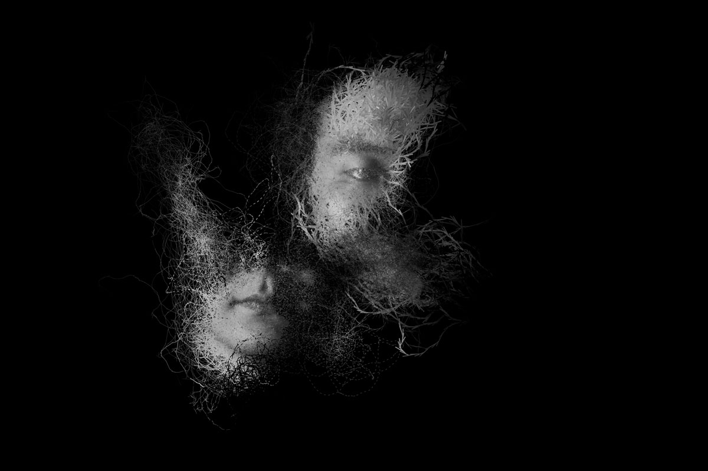
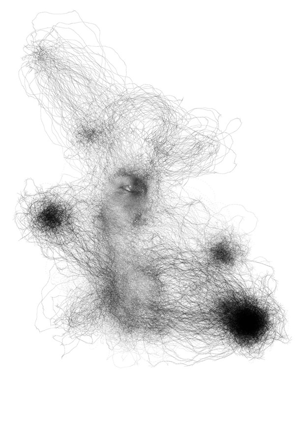
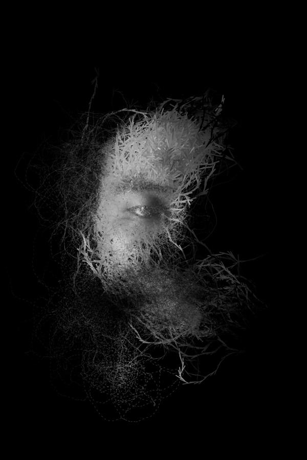
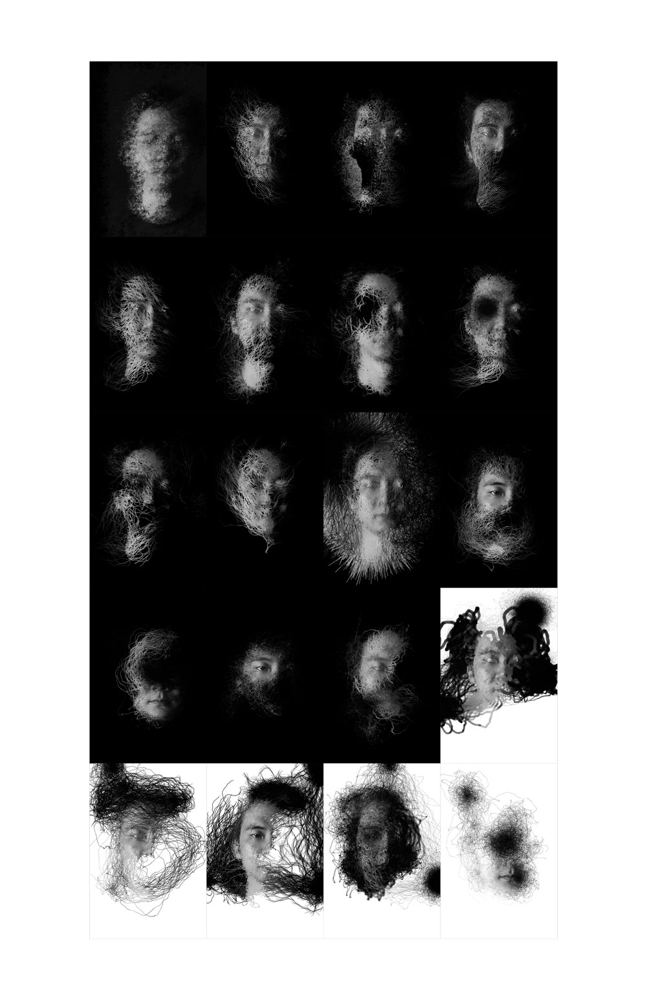
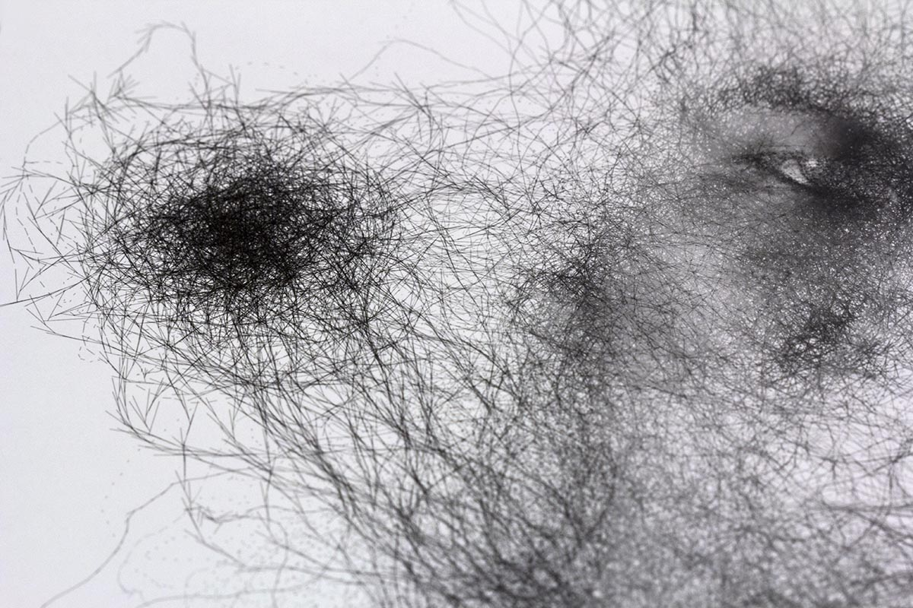
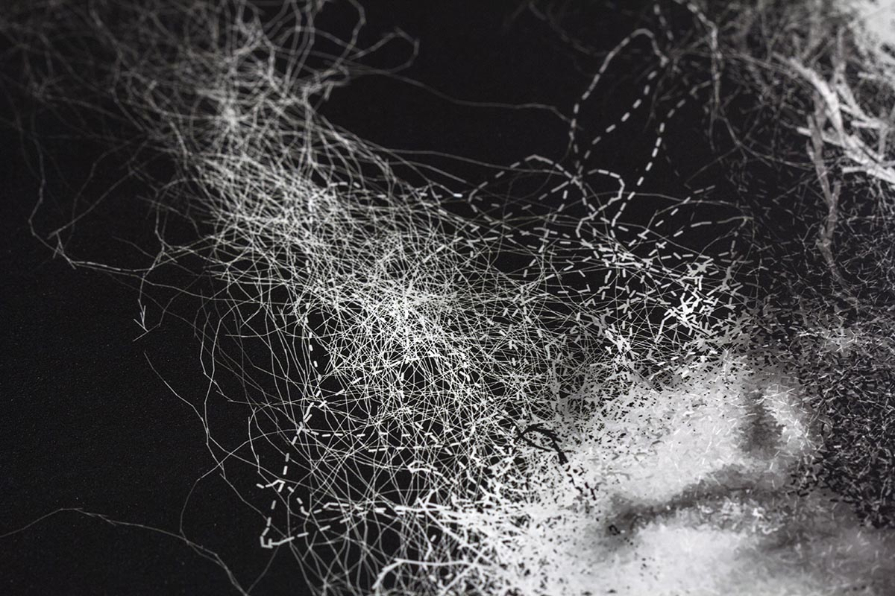

Experiments in generative arts and photography using Processing programming language.

The particles, which are based on the flocking algorithm, follows and records every movement of the artist. The final results are the still images, but the portraits suggest the motion, and reveal the expressive quality of the process.

The project was produced during a Summer workshop (taught by Casey Reas) at Anderson Ranch Arts Center.

