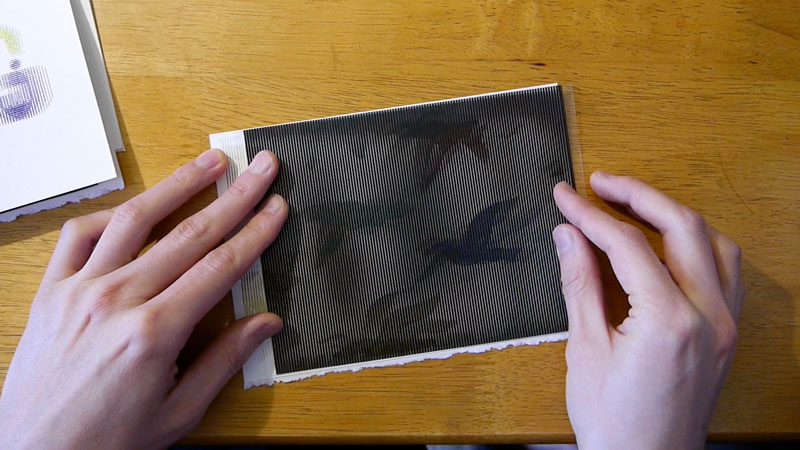
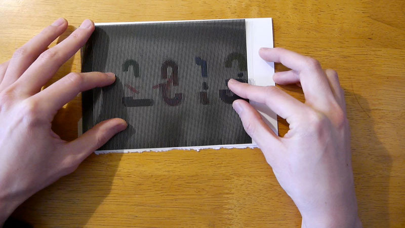
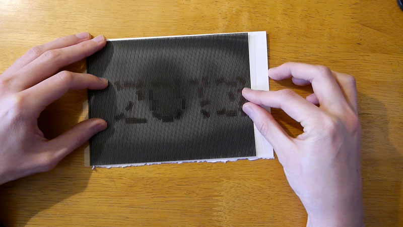
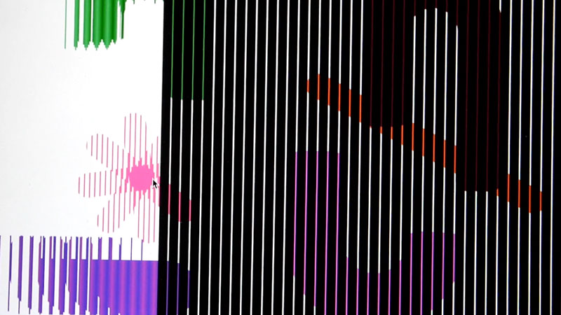
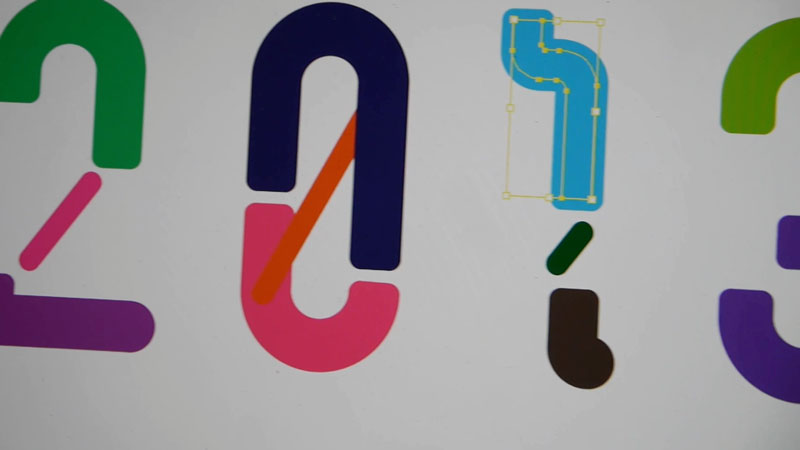

<iframe title="vimeo-player" src="https://player.vimeo.com/video/57336062" width="640" height="360" frameborder="0" allowfullscreen></iframe>

A traditional optical illusion technique meets coding, animation, and experimental typography.
Thinking about the flood of new technologies in animation/design, and the vast possibilities of using these technologies together to create something new, we instead went back to an optical illusion technique that enabled us to create 8-frame animation cycle only using traditional mediums – paper and transparency film. This does not need any special devices/techniques to view animation other than the card itself.

### Technologies
Adobe Illustrator, After Effects and Processing were used to aid the process, and quickly realize the ideas.

### Credits
- Design, animation and coding by Dae In Chung
- Additional design by [Hye Jin Lee](http://sayhye.net)
- Music: Borderline by Plej

