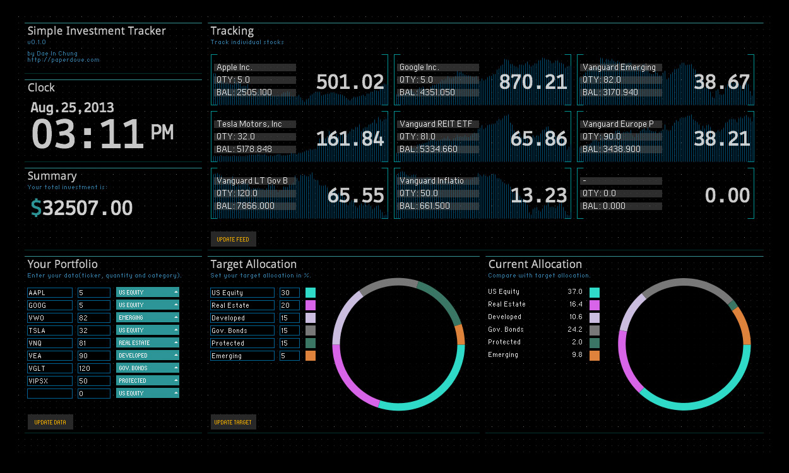
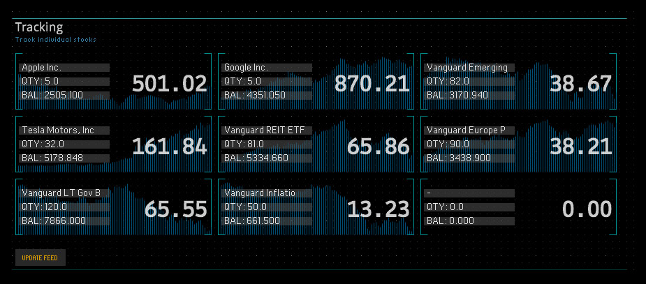
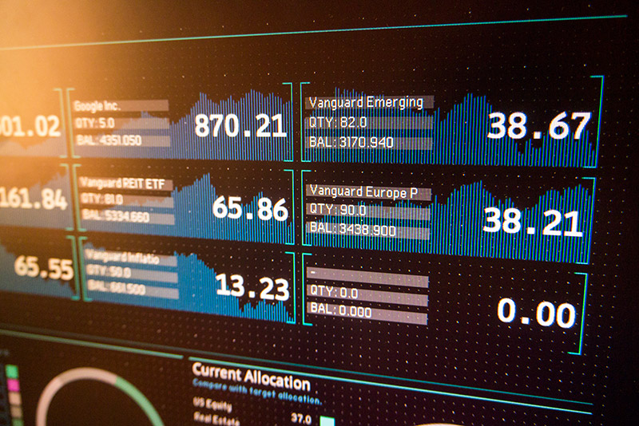
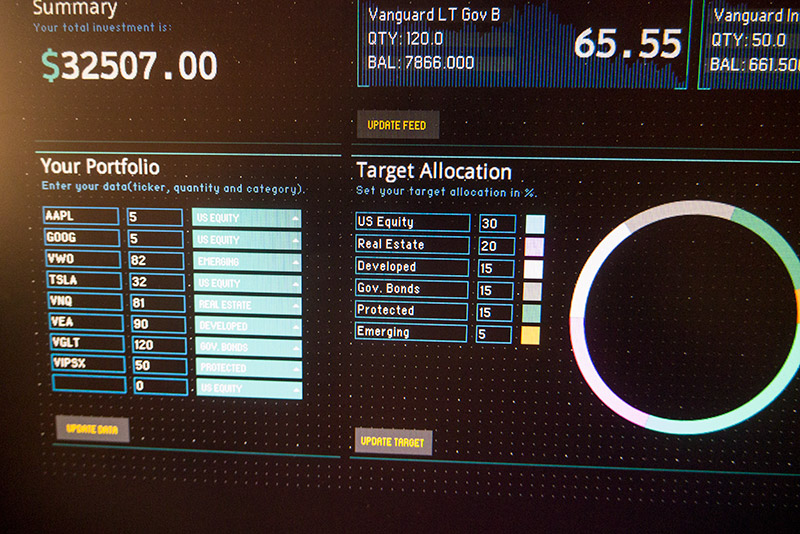

I wanted a simple way to track my investment. I don’t want to log in to my broker’s website every time I need to check the total balance. The search engine results distract my focus and show me too much information. I am not a day trader and never will be, but I want to make sure I’m heading in the right direction – that my investment is appreciating over the long-term, and also track the proper asset allocation once in a while.

### Technologies
The software is developed with Processing, and it gets real-time and historical stock data from Yahoo.

