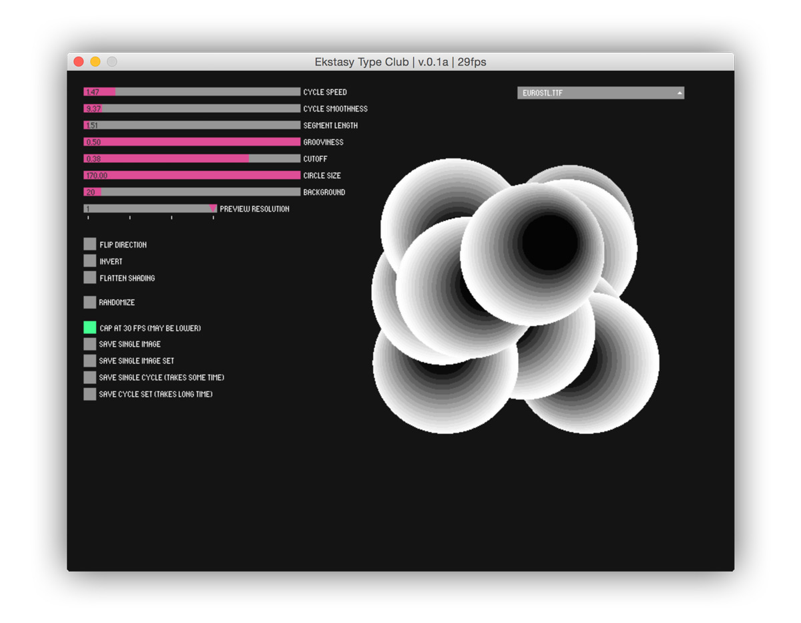
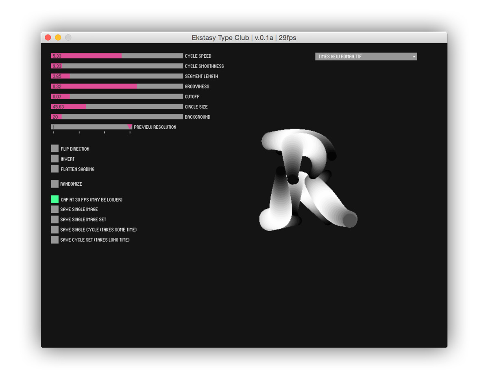
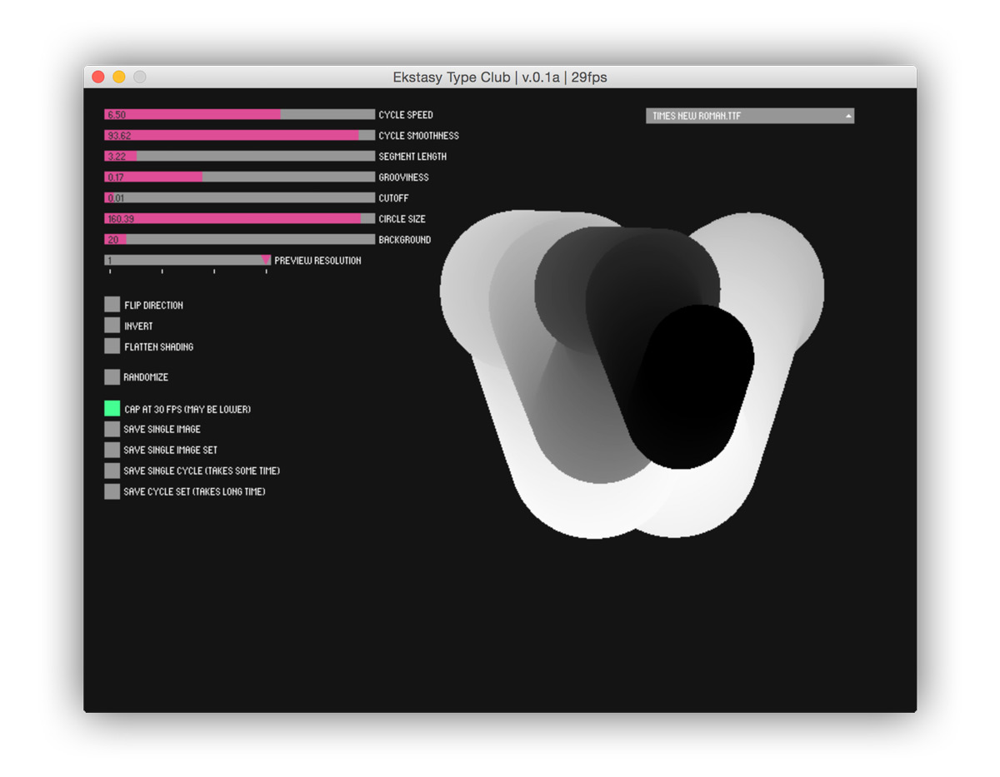

<iframe title="vimeo-player" src="https://player.vimeo.com/video/132310776" width="640" height="360" frameborder="0" allowfullscreen></iframe>

<iframe title="vimeo-player" src="https://player.vimeo.com/video/132337296" width="640" height="400" frameborder="0" allowfullscreen></iframe>

<iframe title="vimeo-player" src="https://player.vimeo.com/video/132337468" width="640" height="400" frameborder="0" allowfullscreen></iframe>

Ekstasy Type Club is an interactive typography application and installation. It explores the qualities of typography such as responsiveness and elasticity. Unlike type on paper, type on screen can interact with readers or users. A system with a few parameters generates a wide variety of letter forms. It constantly updates its shape and creates a unique spatial and temporal rhythm.

### Technologies
Ekstasy Type Club is created with [Processing](http://processing.org) programming language with the help of [Geomerative](http://www.ricardmarxer.com/geomerative/) library to get the outline data of the typefaces.

### Exhibitions and Awards
- Page Magazine, Germany, 2016
- Type Directors Club 62 Communication Design Award Winner, 2016
- Pick of the Month at IdN World, 2015
- Exhibition for the Society of Korean Typography, June 2015

