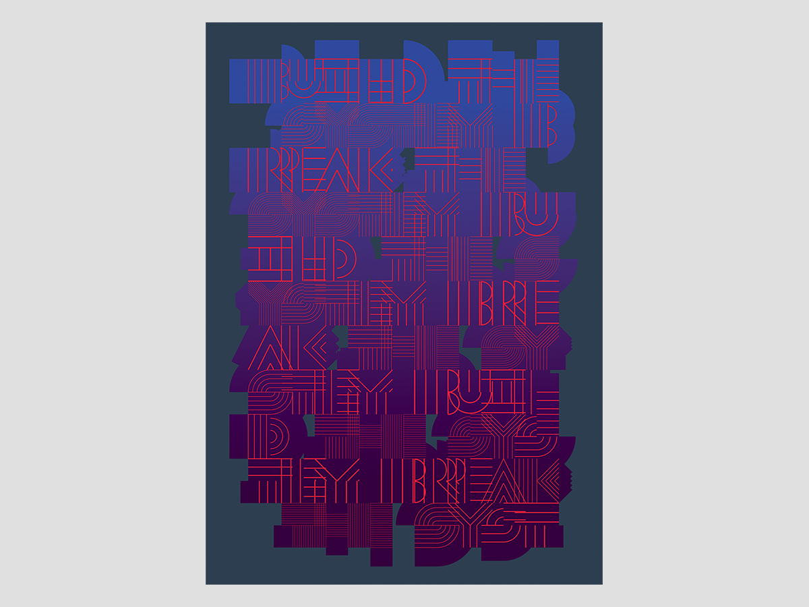

Designers often work with a system, whether it is a grid on a page or a typographical hierarchy. This poster is an exploration into building and revealing a system by gradually breaking away from it. In my own design practice, I start my process by building a system, usually by means of computer programming. Typography in this poster is first created with Processing programming language with a few simple rules. Changing a few parameters of the rules allows me to explore many forms it can create. But eventually, there comes a time when the rigid rules cannot apply any more, and that is when the instinct and manual interventions are needed.

### Publications and Awards
- The T Magazine, Korea, 2017
- Gold Winner, Graphis Poster Annual, 2016

