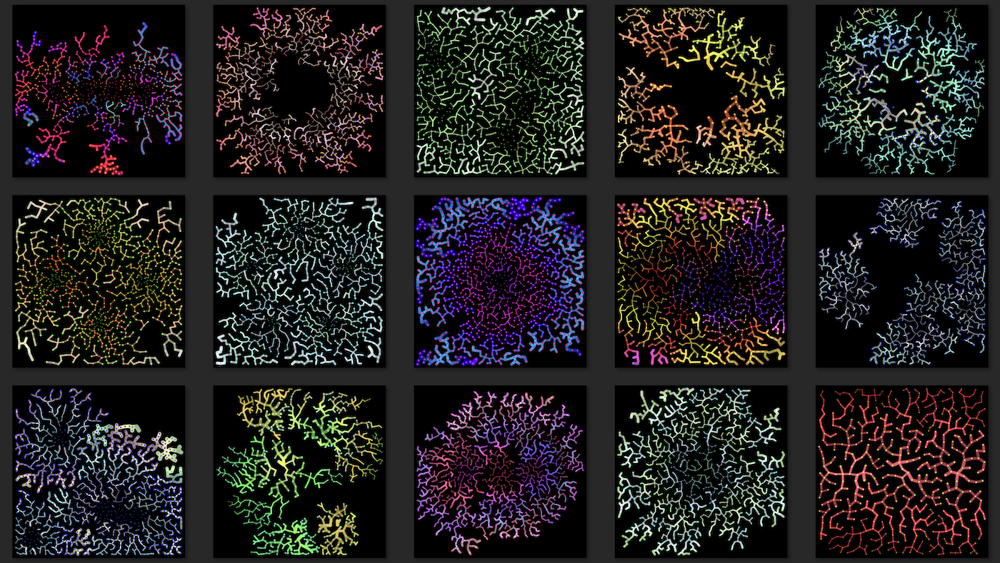

[Growth One](https://www.fxhash.xyz/generative/10249) is a generative NFT project that was launched on fxhash, and lives on the Tezos blockchain.

This project visualizes a growth simulation of a virtual micro organism that follows simple rules. The organism starts with a few seed nodes, and it grows when the seed nodes and search nodes accept each other when they meet certain conditions. The organism loosely resembles structures found in nature such as coral reef or fungus. Do we embrace the beauty of its emerging structure or reject it because of pathogenic associations?