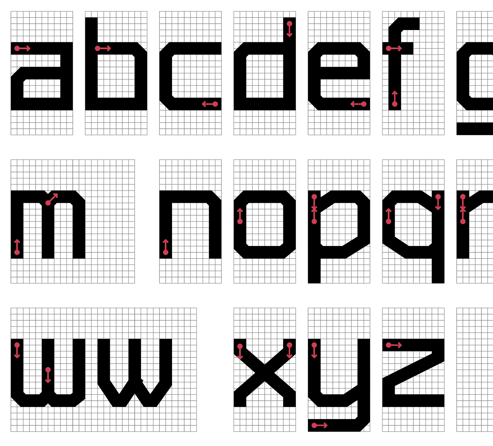
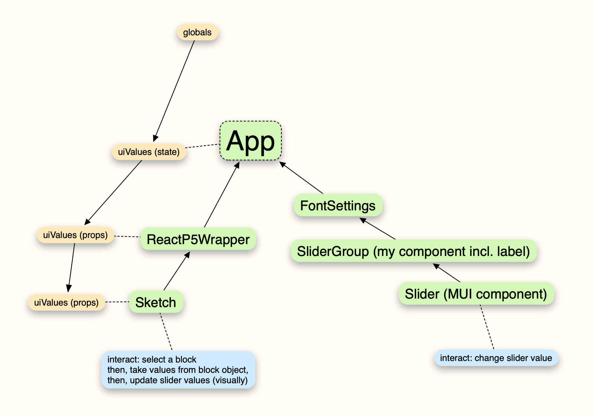
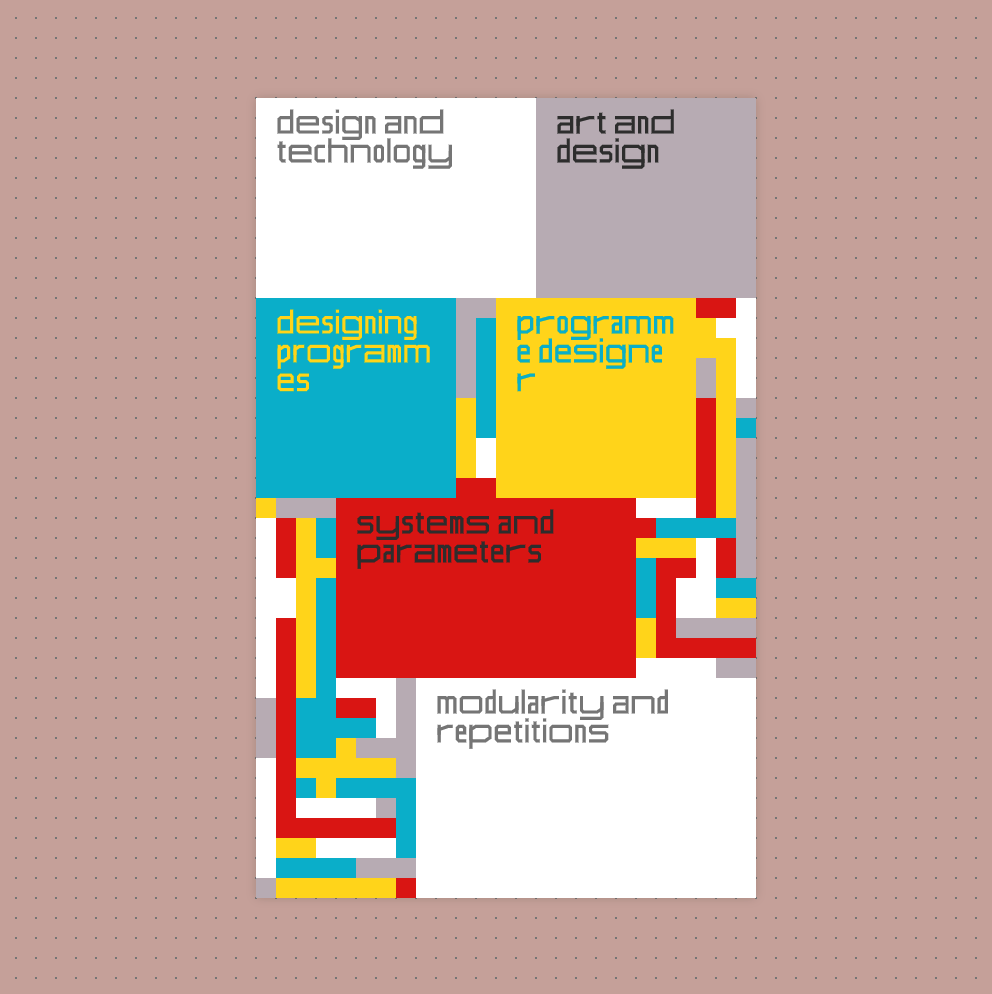

  <video src="./video-converted.mp4" controls loop muted></video>

Modular Design System One (MDS1) is a web app built with JavaScript technologies (HTML5 Canvas, p5.js, react.js and material-ui) that enables me to quickly create design compositions. 

I always wanted a more direct way of creating digital animation. The traditional approach is you define keyframes first, render, wait, and go back to more changes. While this approach has its own merit and gives you fine control, I wanted to "feel" the motion more directly while creating. With my software, I can make changes to the composition and typography while it is being played. There is also chance encounters with different color palettes. I have also created a grid-based font specifically designed for this project. It has variable font-like characteristics. Everything is controlled programmatically. 

It is a work-in-progress and currently, it is only for my personal use. Check out [examples](/tags/MDS1) of motion-typopgraphy compositions created with this software. 

Below are process images and some of the early examples:

  <video src="./process-2.mp4" controls loop muted></video>

  <video src="./process-3.mp4" controls loop muted></video>

  <video src="./process-4.mp4" controls loop muted></video>

