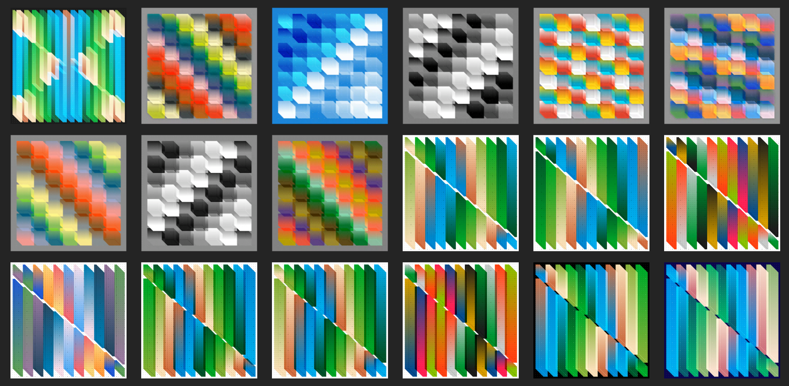

[Structures](https://versum.xyz/user/cdaein) (2022) is an ongoing series that I am releasing through Versum on the Tezos blockchain. I am exploring rigid structures and their variations that I can create based on simple rules. Motion is essential in all of my work, Here, the only motion is colors changing. Any directional movement is an optical illusion. By using 1 dimensional change in 2 dimensional space, I can create many variations.

  <video src="./1641189633389.mp4" controls loop muted></video>

