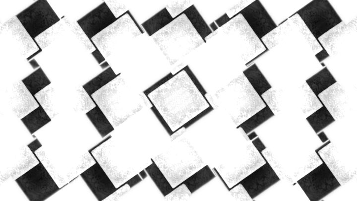
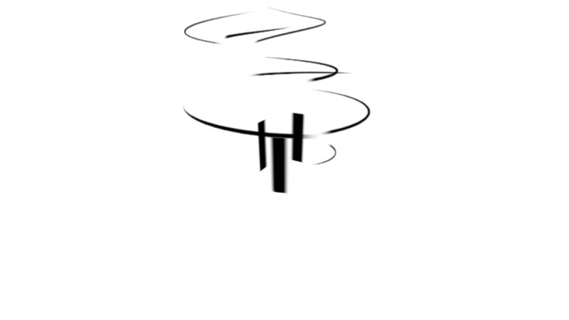
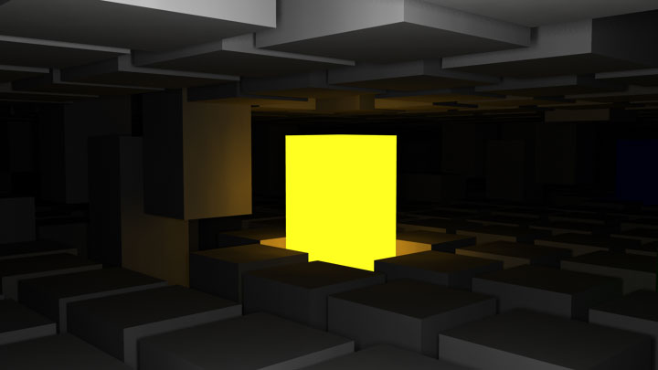

import Vimeo from "@components/mdx/Vimeo.astro";
import GC from "@components/mdx/GridColumn.astro";
import MediaGrid from "@components/mdx/MediaGrid.astro";
import ActivityList from "@components/mdx/ActivityList.astro";

<Vimeo id="869300" width="640" height="360" />

Aluminum bars with resonators and motor driven fans. This is the vibraphone, a keyboard percussion instrument played with mallets and bows. With vibraphone sounds combined with abstract images, Hypervibes invites you to a 3 minute-long journey into your subconsciousness.

- Animation by Dae In Chung
- Music by Jay Garrett

<ActivityList slug="hypervibes" sortByType />

