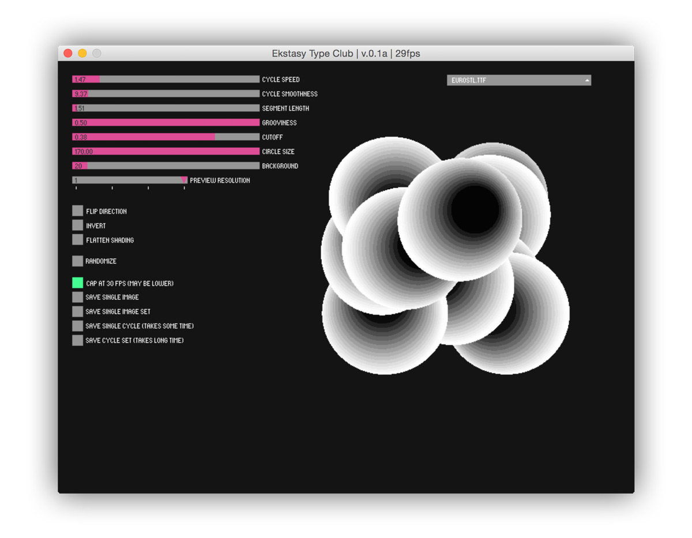
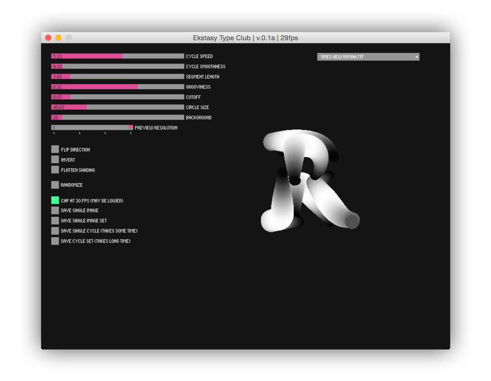
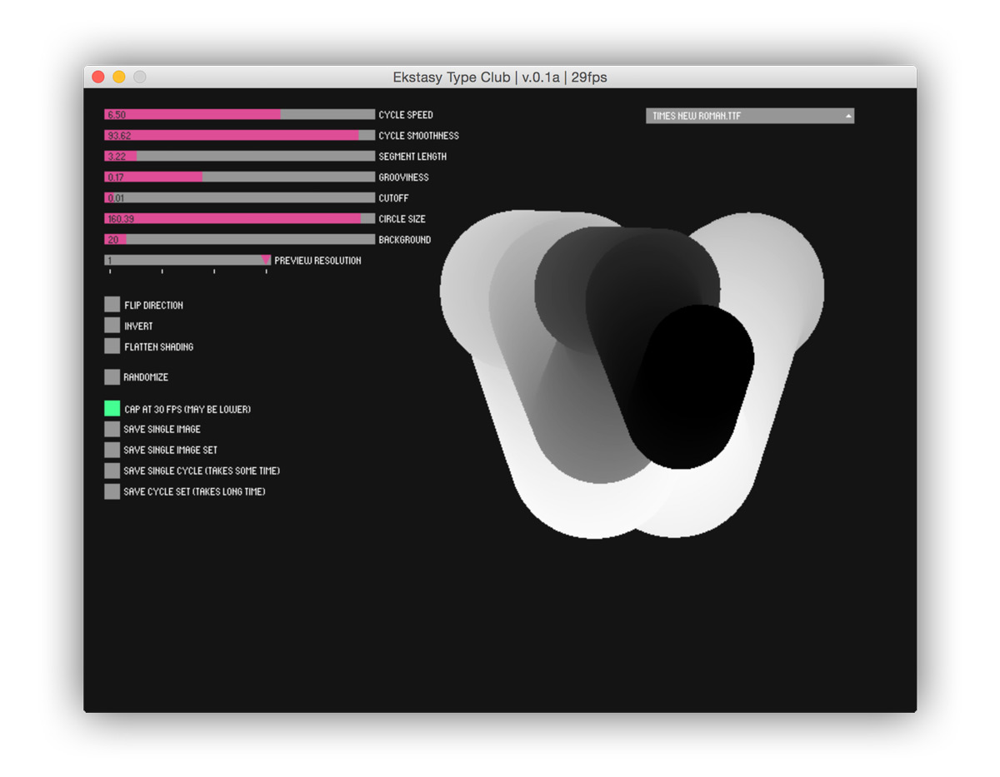

import Vimeo from "@components/mdx/Vimeo.astro";

<Vimeo id="132310776" width="640" height="360" />

<Vimeo id="132337296" width="640" height="400" />

<Vimeo id="132337468" width="640" height="400" />

Ekstasy Type Club is an interactive typography application and installation. It explores the qualities of typography such as responsiveness and elasticity. Unlike type on paper, type on screen can interact with readers or users. A system with a few parameters generates a wide variety of letter forms. It constantly updates its shape and creates a unique spatial and temporal rhythm.

### Technologies

Ekstasy Type Club is created with [Processing](http://processing.org) programming language with the help of [Geomerative](http://www.ricardmarxer.com/geomerative/) library to get the outline data of the typefaces.
