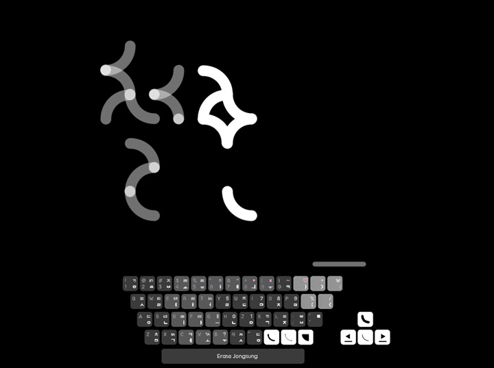
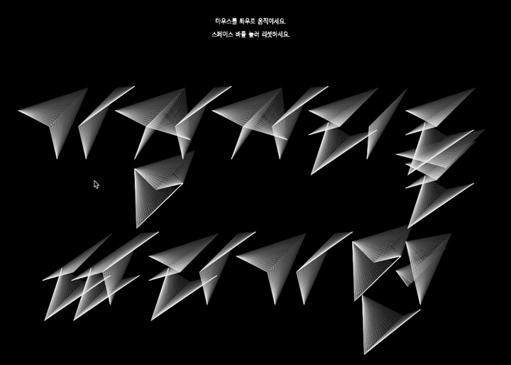
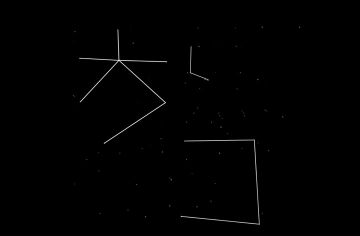
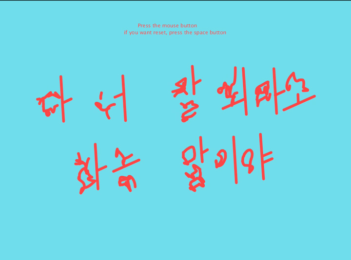
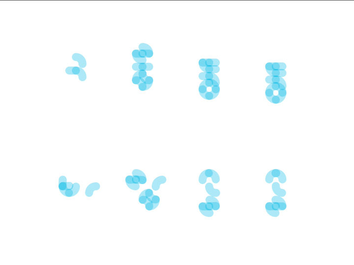

<iframe title="vimeo-player" src="https://player.vimeo.com/video/150907301" width="640" height="360" frameborder="0" allowfullscreen></iframe>

### 동기

1. 글자꼴과 타이포그래피 디자인은 매체의 발달과 함께 해왔다. 각종 필기구, 목판, 금속활자, 디지털 이미지와 같은 글자꼴 복제 기술은 시대정신과 맞물려 글자의 형태를 결정했으며, 이러한 글자꼴 디자인은 매체와 사회의 모습을 지배하며 다음 세대의 집단 관념을 변화시켰다.
2. 인터넷과 같은 온라인 매체는 하나의 독립된 세계를 이루는 단계를 넘어, 지금은 세계를 이해하는 인식의 창으로서 '현실의 재현'이 아닌 '현실 그 자체'가 되고 있다. 하지만, 지금 우리가 다루는 타이포그래피의 대부분은 정형적 매체, 즉, 인쇄매체를 중심으로 한 사항을 벗어나지 못한다. 심지어 온라인 매체에서의 타이포그래피 조차 인쇄의 연속으로 인식되곤 했다.
3. 스크린, 온라인, 움직임, 상호작용이 상식으로 통용되는 '현실'에서 타이포그래피는 어떤 가능성을 내보일 것인가.

### 목표

온라인 매체와 타이포그래피 디자인을 융합하여 글자 형태를 통한 표현 방식을 확장한다.

### 결과

학생들은 각자 자신의 컨셉을 가지고, 조건에 따라 변화하는 인터렉티브 타이포그래피 작업물을 창작하였다.

### 전시 및 수상

- 2015년 한국타이포그라피학회 '교차' 전시회 최우수 작품상 수상
- Type Directors Club 62 Communication Design Award Winner
