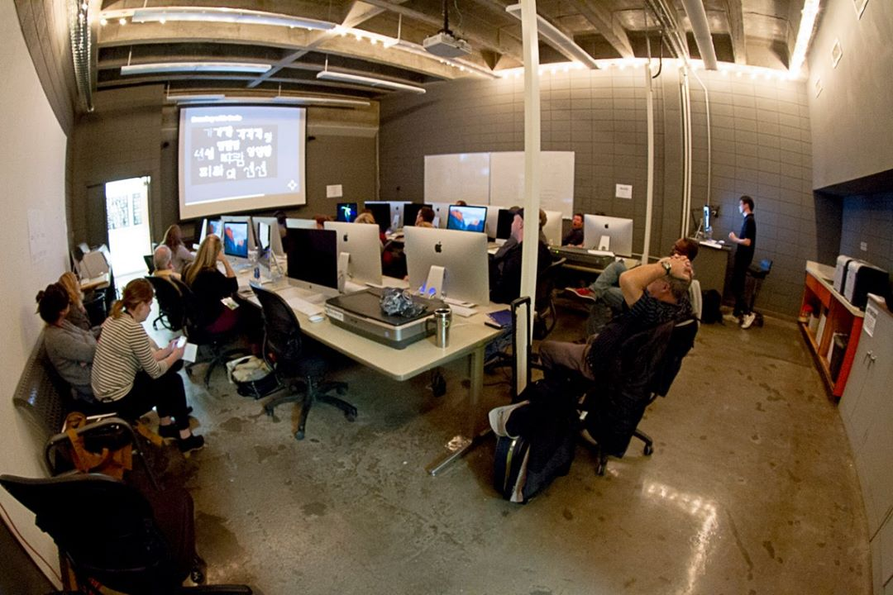

Frontier is a conference concerned with alternative models for learning, radical pedagogy, utopianism, emerging technology and tools, global economics and design, virtual classrooms, invisible worlds, the growing relationship between design and tech, homogeneity in design, imagined scenarios, the role of critique in a post-internet culture, and the speculative future of graphic design education. — from [the website](http://frontier.aiga.org)

This presentation shares the process and result of a course titled Type+Media, which was offered in 2015. It was designed to teach typography and letterform design through computer programming. The presentation slides are available [online](http://exp.paperdove.com/aiga-frontier-2016).
