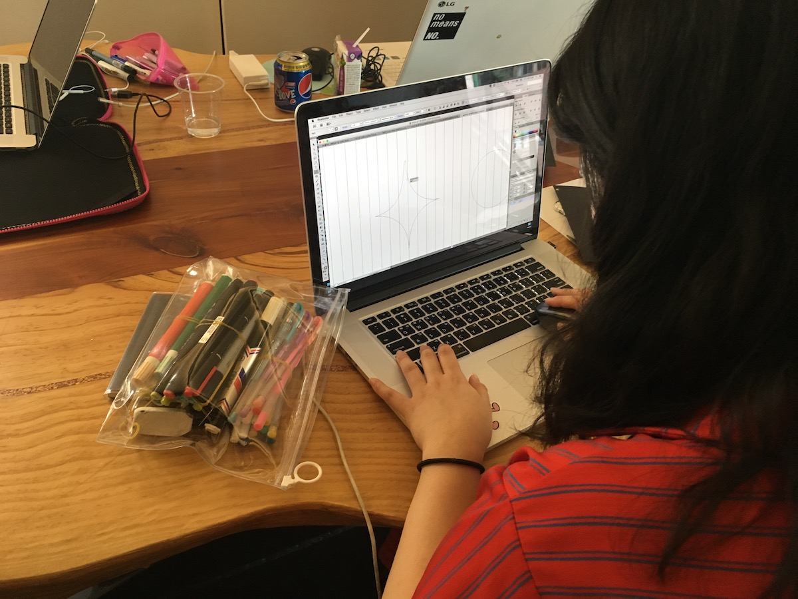
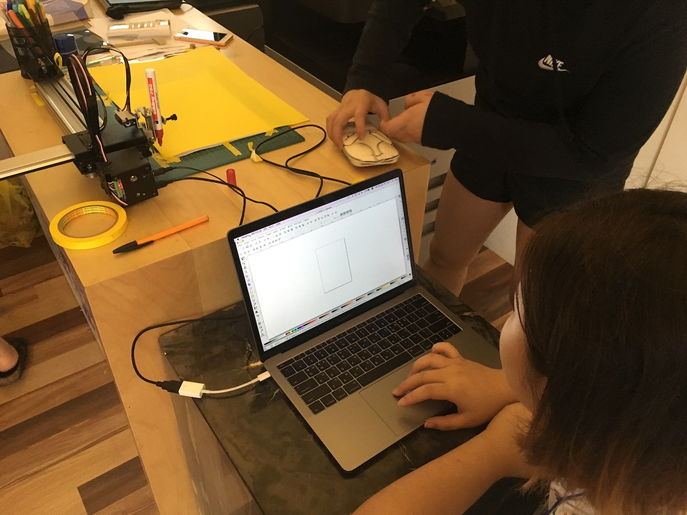
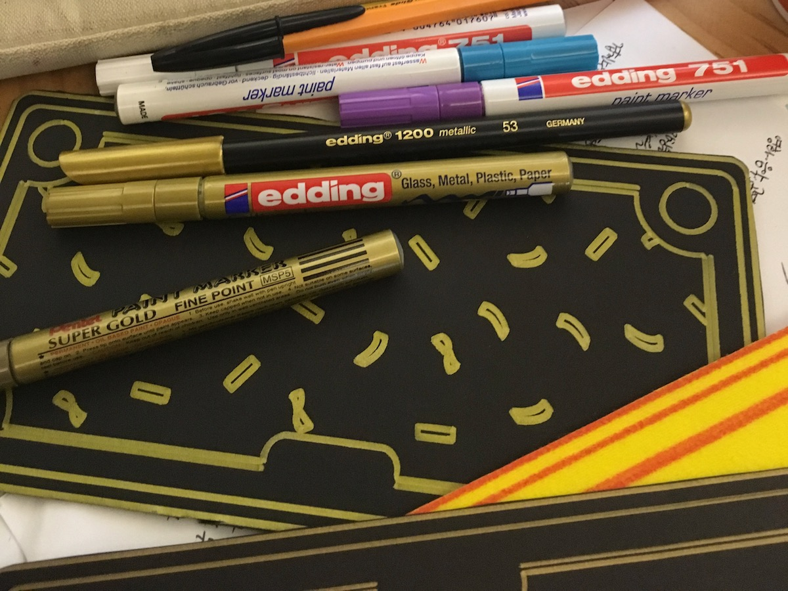
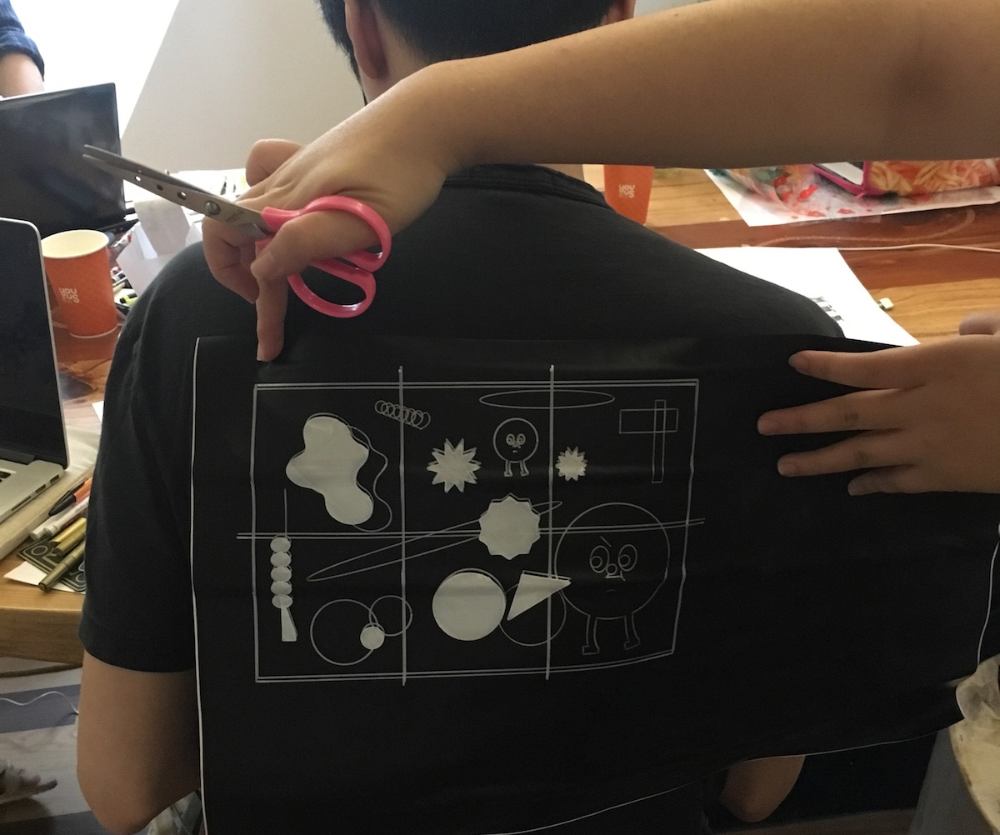
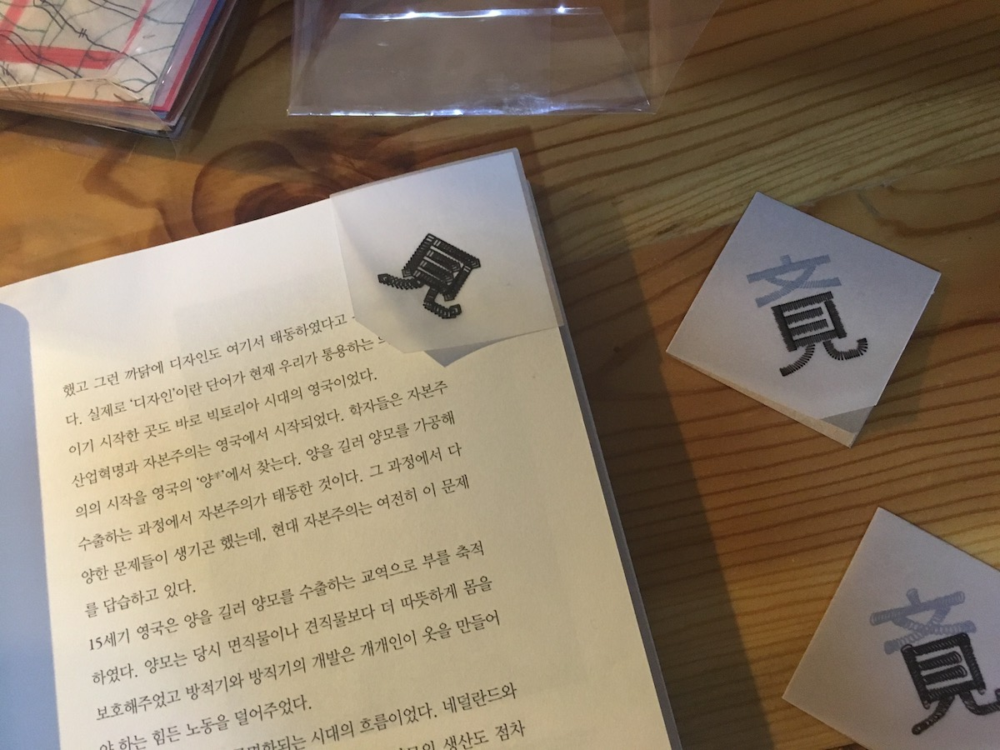
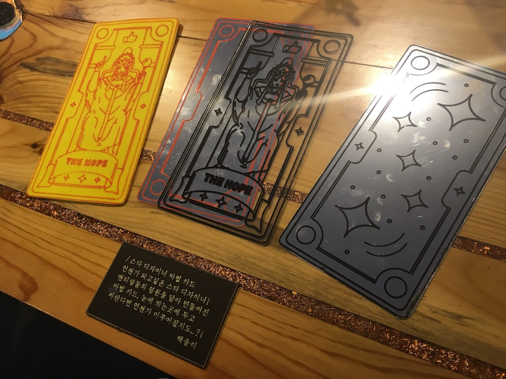

2017년 [디자인캠프](https://www.facebook.com/designerschool.net/)는 7월 25일부터 한 주간 서울 필동문화예술공간 예술통에서 열렸다. [이혜진](http://sayhye.net)과 정대인은 9명의 멘티들과 '가내소공업'이라는 주제로 소형 플로터를 사용한 디자인 워크샵을 진행했다.

대량생산과 자동화에 이어 인공지능 등 세상의 변화를 겪고 있는 지금, 기계가 대체할 수 없는 디자이너의 역할은 무엇일까? 우리는 사람의 손길이 들어간 작업을 시도해보려고 한다. 작품의 질, 노동의 즐거움, 과정을 중시했던 윌리엄 모리스의 공예운동을 돌아보고, 기존의 작업방식에서 조금 벗어나 익숙하지 않고 비효율적인 다양한 방식을 이용한 새로운 탐구를 해본다.
우리는 꼭 효율성, 자동화, 시간/비용 절감, 생산성만을 최고의 목표로 삼아야 할까? 이를 통해 잃어버리는 것은 무엇인가?

### 작업목표

- 기계 도구를 활용하면서도 기계로 재현할 수 없는 디자이너의 손길이 닿은 작업을 해보자.
- 플로터라는 도구를 이용하여 디자인의 계획부터 생산까지 통합된 결과물을 만들어 본다.
- 익숙한 작업방식에서 벗어나 탐구하고 실험한다.
- 다양한 재료와 아날로그적인 기법을 이용해서 재료, 촉감 등의 미묘한 차이를 느껴본다.
- 사람들과 함께 논의를 통해서 작업을 발전시켜 나간다.

### 프로젝트

윌리엄 모리스는 “유용하거나 아름답다고 생각하는 것 외에는 당신의 집안에 들여 놓지 말아라,”고 했다.
내가 소유한 물건들 중에 가장 아끼는 것은 무엇이며, 쓸모없는 것은 무엇인지, 그 이유는 무엇인지 잠깐 생각해보자.
나에게, 그리고 다른 사람에게 쓸모있는 컨텐츠를 찾고, 그에 알맞는 아름다운 시각적 형태를 구성한다.
주어진 시간 내에 10개의 복제본을 생산한다.
