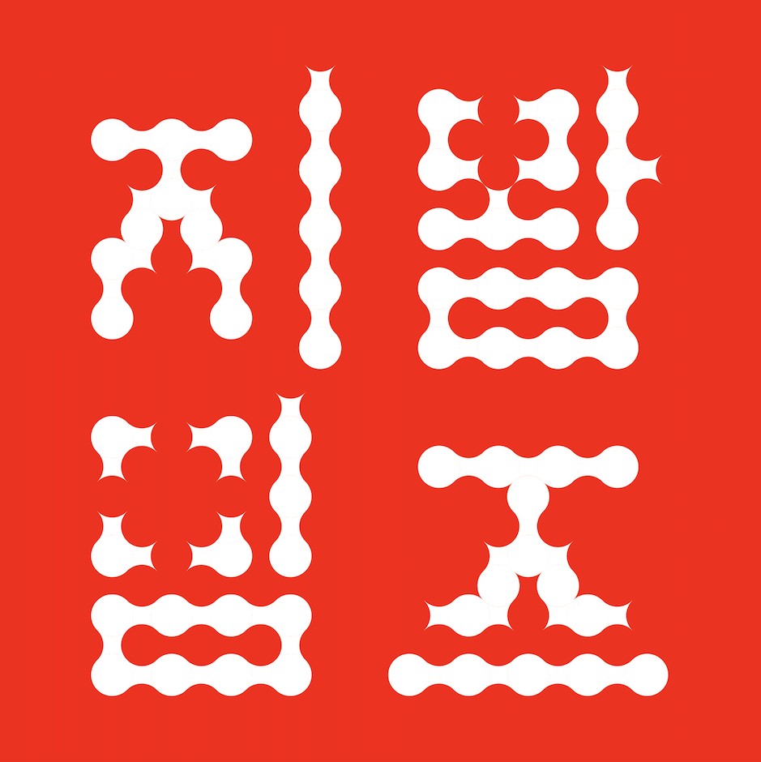
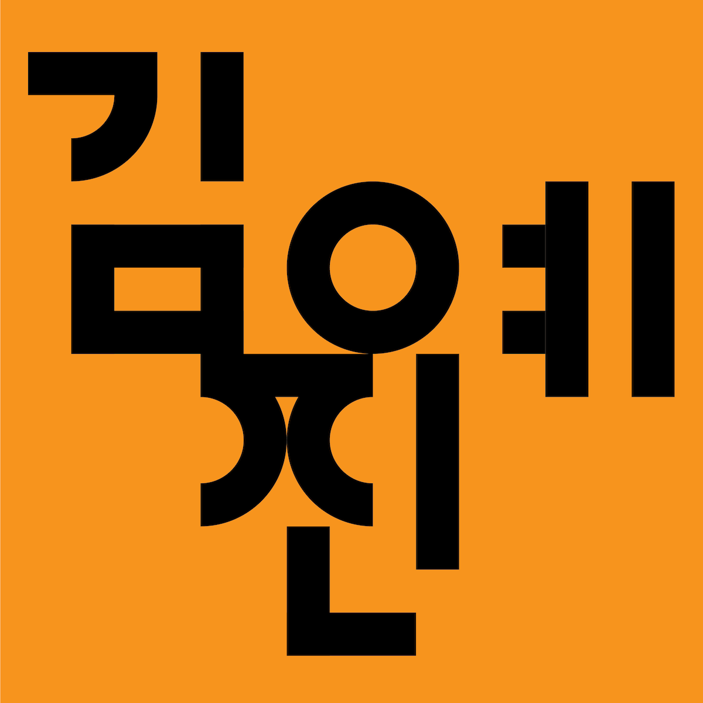
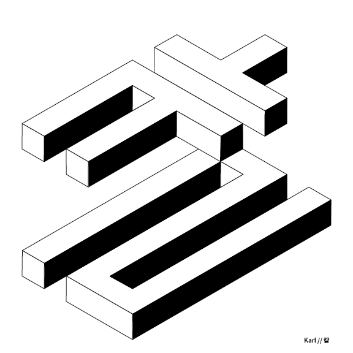
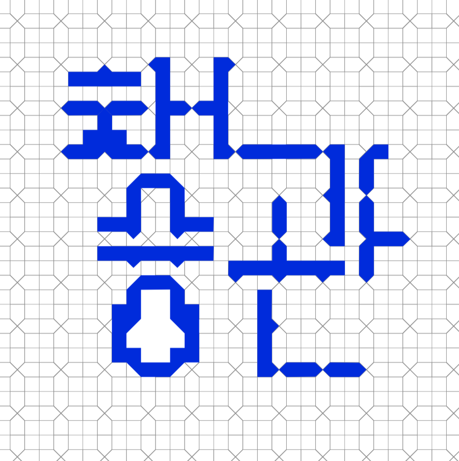
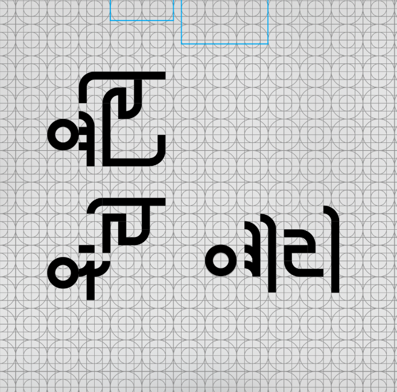
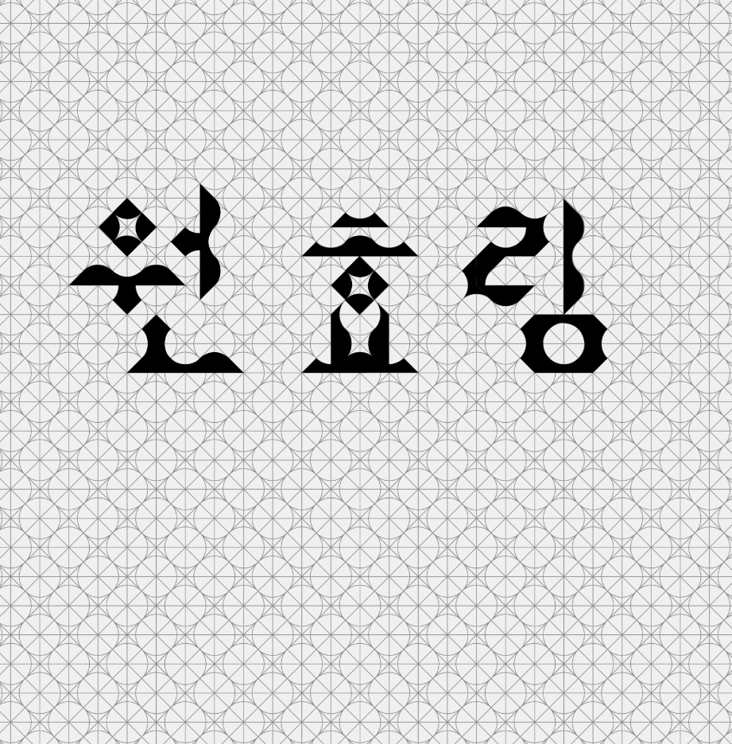

A two-day Hangeul Workshop was held at Maryland Institute College of Art. The workshop was designed for students who may or may not know Korean. The main goal was to introduce Hangeul as a modular design system.

Taught by Dae In Chung and [Minsun Eo](http://minsuneo.nyc).
