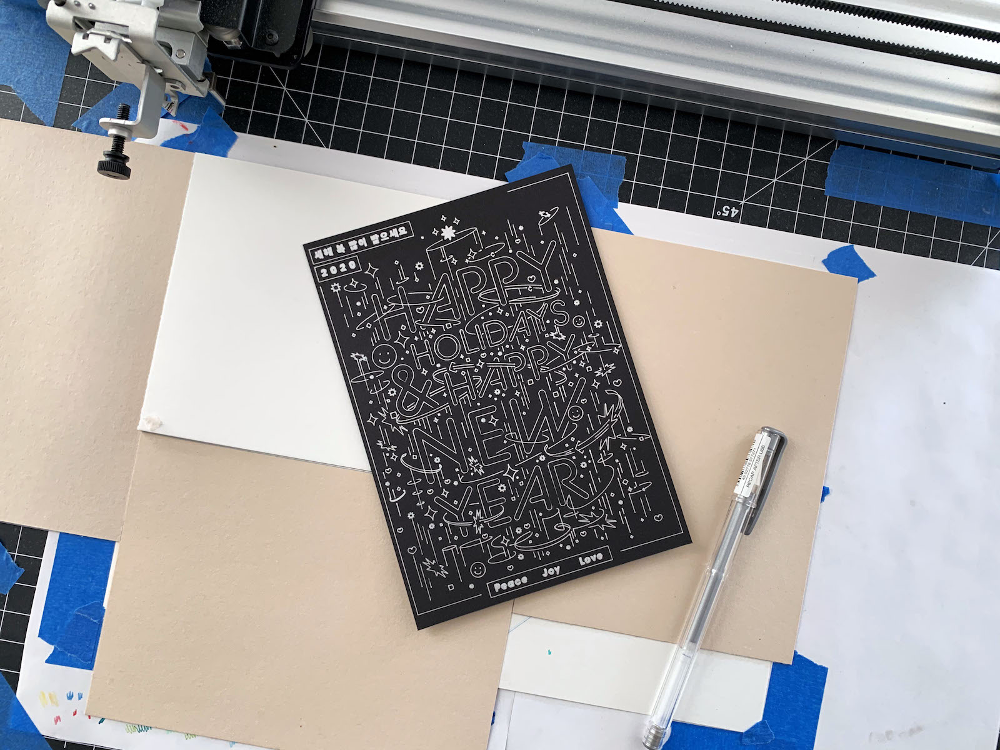

import Video from "@components/mdx/Video.astro";
import vid1 from "./video.mp4";

<Video src={vid1} />

[Visit Project](https://exp.paperdove.com/happy-holidays-2020/)

We wanted to take a traditional holiday card format to digital mobile experience. The original card was printed with Axidraw plotter using glitter pens. We loved the texture and how the light was reflected on the surface. The digital screen is already bright and sharp but it feels very different from ink on paper. Using motion and orientation sensors on mobile devices along with animation was how we decided to translate that physical experience to the web. Now, users can also customize the message and share with others all from their browser.

Collaboration with [@justsayhye](https://instagram.com/justsayhye).

