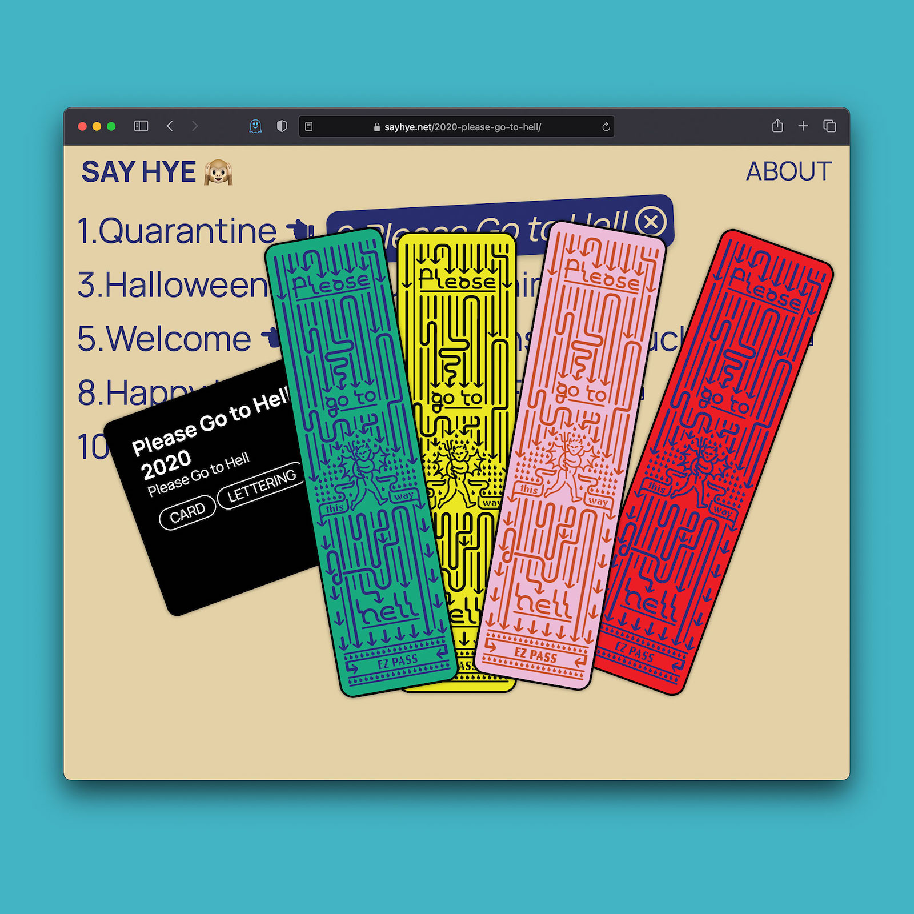
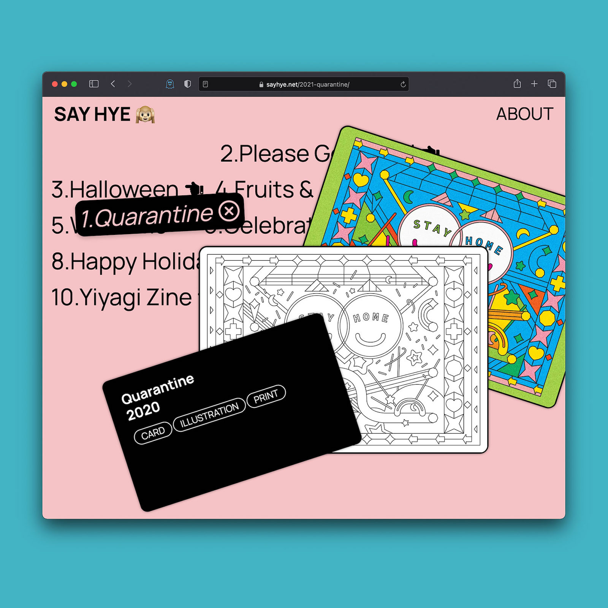

Website design & development for [sayhye.net](https://sayhye.net)

I used Gatsby.js (on top of React.js) for performance and easy data management. React-draggable package was used for the experimental yet functioning drag interface. It also works well with multi-touch mobile devices.
