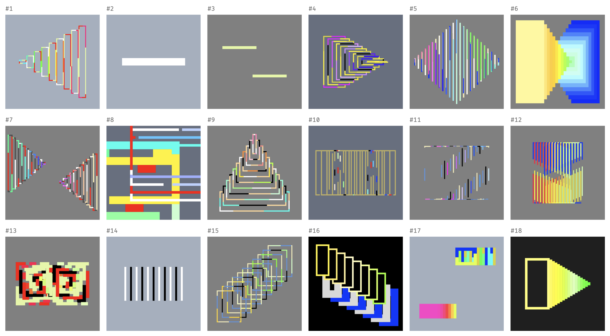

import Video from "@components/mdx/Video.astro";
import vid1 from "./duet-168.mp4";
import FxHash from "@components/FxHash.astro";

[Duet](https://www.fxhash.xyz/generative/slug/duet) explores generative+computational motion and creates an almost infinite sequence of visual compositions. Two groups of shapes transform, merge, and split randomly. What can be disorienting starts to make sense as every element is animated from one to the other. This transition animation is what connects random pieces and creates a relationship between them. Each element is mathematically interpolated, with its motion defined by an equation.

Although there are key moments, it is hard to summarize time-based work as a static image. As a constantly evolving generative motion piece, Duet invites viewers to form their impression by feeling the rhythm over time.

You can read about [my process](https://daeinc.substack.com/p/notes-on-duet-a-generative-motion).

<FxHash title="duet" numCols={8} />
